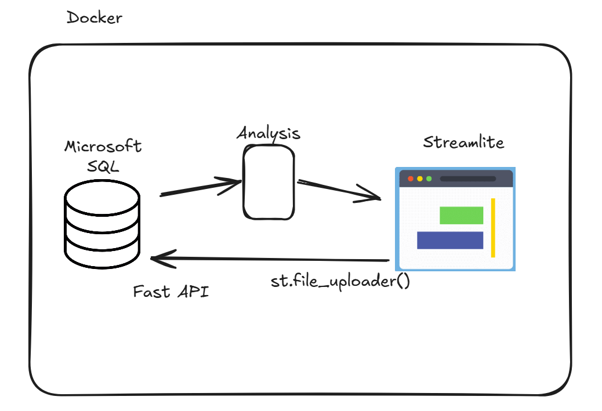

# CausalBoard
Create a web dashboard, displaying the result of different causal analysis

## Installation

### Prerequisites

- Python 3.12
- scikit-learn
- matplotlib.pyplot
- seaborn
- pandas
- cvxpy

## Functionalities
- Input place to download the data to be analyzed
- Selector for the different type of causal analysis
    - SCM
- Selector for different parameters
- Display results
    - Plot
    - Table of coefficients

## Architecture

## To do
- Streamlit app
- DB
- Fast API
- Docker